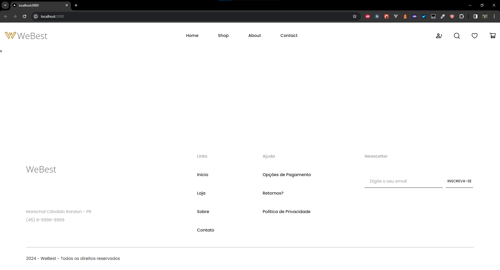

## 01 - Iniciando Curso

## Fazendo checkout do projeto

Para fazer o checkout do projeto, basta clonar o repositório do GitHub:

```bash
git clone https://github.com/gabrielestefono/curso_swiper.git
```

## Acionando o projeto correto

Após clonar o repositório, navegue pelo terminal até a pasta do projeto, de acordo com a aula que você deseja acessar. Por exemplo, para acessar a aula 01, acesse a pasta examples/projeto_base_01.

```bash
cd curso_swiper/examples/projeto_base_01
```

## Instalando as dependências

Dentro da pasta do projeto, execute o comando abaixo para instalar as dependências do projeto:

```bash
npm install
```

Isso fará com que o npm instale todas as dependências do projeto, de acordo com o arquivo package.json.

## Rodando o projeto

Após instalar as dependências, execute o comando abaixo para rodar o projeto:

```bash
npm run dev
```

Isso fará com que o projeto seja executado em modo de desenvolvimento, e você poderá acessá-lo no endereço http://localhost:3000.

## Conclusão

Pronto! Agora você já está com o projeto rodando em sua máquina, e pode começar a explorar o código e fazer as alterações que desejar. Lembre-se de que o projeto é seu, e você pode fazer o que quiser com ele. Aproveite o curso!

O projeto deve ficar da seguinte forma:

