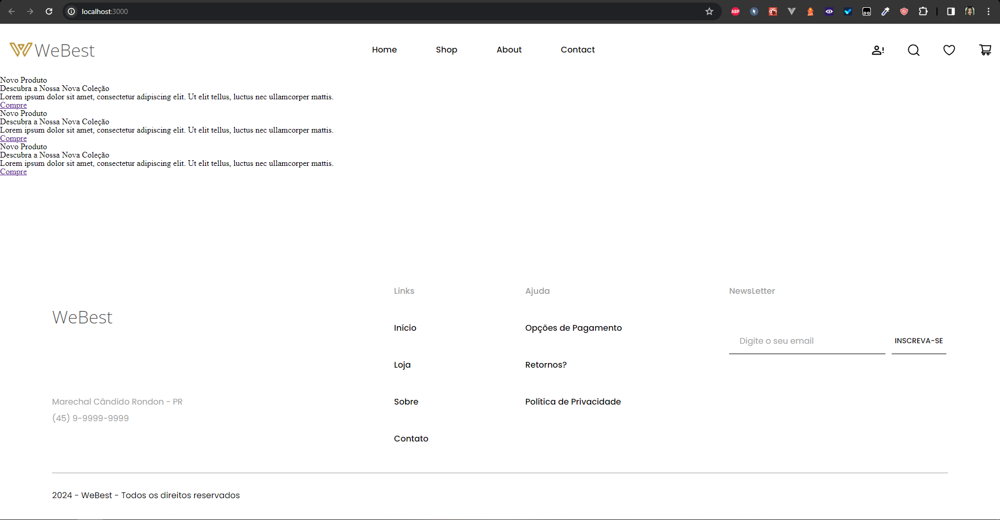
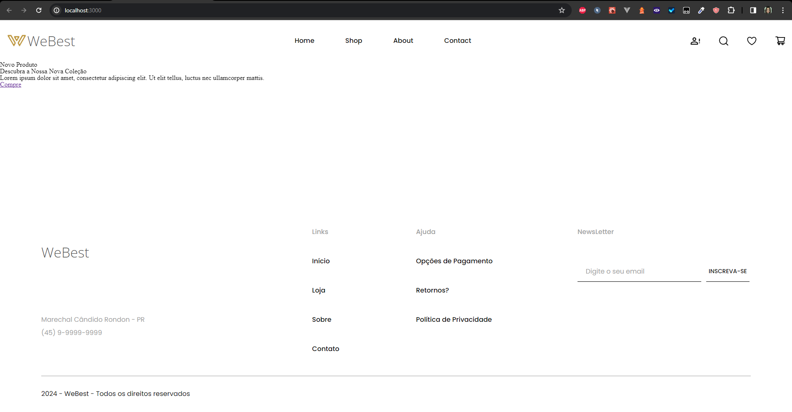

# Vamos ao Desafio!

Agora que você já sabe como instalar o Swiper, o desafio é criar um carrossel de produtos, conforme mostrado no layout abaixo:


Para isso, as dimensões do carrossel devem ser:
// Colocar as dimensões do carrossel aqui depois

## Criando um componente para o carrossel

Crie um componente chamado `CarouselPrincipal` em uma pasta chamada `home` na pasta `components` do projeto. Este componente deve ser responsável por renderizar o carrossel de produtos principal da home.

Por hora, o componente será esse:
```javascript
export default function CarouselPrincipal() {
	return (
		<div>
			<h1>Carousel Principal</h1>
		</div>
	);
}
```

## Importando o Componente

Agora, importe o componente `CarouselPrincipal` no arquivo `index.tsx` e renderize-o na tela. O arquivo `index.tsx` deve ficar assim:

```javascript
import CarouselPrincipal from "@/components/home/CarouselPrincipal";
import Layout from "@/components/layout/Layout";

export default function Home() {
  return (
      <Layout>
        <CarouselPrincipal/>
      </Layout>
  );
}
```

## Criando estrutura html do carrossel

Agora, vamos criar a estrutura html do carrossel. Considerando que o carrousel terá um container principal, com uma imagem do produto, e um container interno com título, subtítulo, descrição e botão de ação, a estrutura html do carrossel `deveria` ser essa:

```javascript
<div>
	<div>
		<div>
			<h2>Novo Produto</h2>
			<h1>Descubra a Nossa Nova Coleção</h1>
			<p>Lorem ipsum dolor sit amet, consectetur adipiscing elit. Ut elit tellus, luctus nec ullamcorper mattis.</p>
			<a href="/">Compre</a>
		</div>
		
	</div>
</div>
```

Porém, como o Swiper exige uma estrutura específica, a estrutura html do carrossel `deve` ser essa:

```html
<div>
	<swiper-container>
		<swiper-slide>
			<div>
				<h2>Novo Produto</h2>
				<h1>Descubra a Nossa Nova Coleção</h1>
				<p>Lorem ipsum dolor sit amet, consectetur adipiscing elit. Ut elit tellus, luctus nec ullamcorper mattis.</p>
				<a href="/">Compre</a>
			</div>
			
		</swiper-slide>
	</swiper-container>
</div>
```

Obs: A div externa é opcional, mas ainda não aprendemos a estilizar o Swiper diretamente, então, vamos utilizar essa abordagem para estilizar o Swiper.

Obviamente, o carrossel terá mais de um produto, então a estrutura html do carrossel `será` essa:

```javascript
import carousel from './carousel.png';
export default function CarouselPrincipal() {
	return (
	<div>
		<swiper-container>
			<swiper-slide>
				<div>
					<h2>Novo Produto</h2>
					<h1>Descubra a Nossa Nova Coleção</h1>
					<p>Lorem ipsum dolor sit amet, consectetur adipiscing elit. Ut elit tellus, luctus nec ullamcorper mattis.</p>
					<a href="/">Compre</a>
				</div>
				
			</swiper-slide>
			<swiper-slide>
				<div>
					<h2>Novo Produto</h2>
					<h1>Descubra a Nossa Nova Coleção</h1>
					<p>Lorem ipsum dolor sit amet, consectetur adipiscing elit. Ut elit tellus, luctus nec ullamcorper mattis.</p>
					<a href="/">Compre</a>
				</div>
				
			</swiper-slide>
			<swiper-slide>
				<div>
					<h2>Novo Produto</h2>
					<h1>Descubra a Nossa Nova Coleção</h1>
					<p>Lorem ipsum dolor sit amet, consectetur adipiscing elit. Ut elit tellus, luctus nec ullamcorper mattis.</p>
					<a href="/">Compre</a>
				</div>
				
			</swiper-slide>
		</swiper-container>
	</div>
	);
}
```

Neste ponto, caso esteja utilizando typescript, o código mostrará alguns erros, apesar de ser compilado corretamente. Isso acontece porque o typescript não reconhece as tags do Swiper. Para resolver isso, você pode criar um arquivo de declaração de módulo para o Swiper.

## Criando um arquivo de declaração de módulo para o Swiper

Crie uma pasta chamada `helpers` na raiz do projeto e dentro dela crie um arquivo chamado `swiper.d.ts`. Dentro desse arquivo, adicione o seguinte código:

```typescript
declare namespace JSX {
	interface IntrinsicElements {
	    'swiper-container': any;
	    'swiper-slide': any;
	}
}
```
Verá que o erro sumirá.

Neste ponto podemos abrir o projeto e teremos algo assim:


## Configurando o Swiper

Agora, vamos configurar o Swiper. A primeira coisa que precisamos fazer é registrar o swiper, como podemos ver na documentação do Swiper. Para isso, devemos simplesmente importar o método `register` do Swiper e chamá-lo. O código para isso é:

```javascript
import { register } from "swiper/element";
register();
```

Neste ponto, o código do componente `CarouselPrincipal` deve estar assim:

```javascript
import carousel from './carousel.png';
import { register } from "swiper/element";
register();

export default function CarouselPrincipal() {
	return (
	<div>
		<swiper-container>
			<swiper-slide>
				<div>
					<h2>Novo Produto</h2>
					<h1>Descubra a Nossa Nova Coleção</h1>
					<p>Lorem ipsum dolor sit amet, consectetur adipiscing elit. Ut elit tellus, luctus nec ullamcorper mattis.</p>
					<a href="/">Compre</a>
				</div>
				
			</swiper-slide>
			<swiper-slide>
				<div>
					<h2>Novo Produto</h2>
					<h1>Descubra a Nossa Nova Coleção</h1>
					<p>Lorem ipsum dolor sit amet, consectetur adipiscing elit. Ut elit tellus, luctus nec ullamcorper mattis.</p>
					<a href="/">Compre</a>
				</div>
				
			</swiper-slide>
			<swiper-slide>
				<div>
					<h2>Novo Produto</h2>
					<h1>Descubra a Nossa Nova Coleção</h1>
					<p>Lorem ipsum dolor sit amet, consectetur adipiscing elit. Ut elit tellus, luctus nec ullamcorper mattis.</p>
					<a href="/">Compre</a>
				</div>
				
			</swiper-slide>
		</swiper-container>
	</div>
	);
}
```

E ao abrir o projeto no navegador, teremos um swiper funcionando, mas sem estilização. O resultado será algo assim:



Podemos mover os slides para os lados perfeitamente. Neste ponto só nos resta estilizar o swiper e finalizar o desafio.

### Explicação:
Porque estamos importando o método `register` do Swiper e chamando-o? 

O método `register` é responsável por registrar os componentes do Swiper que foram criados por terceiros, alguns como pode vê, são disponibilizados pelo próprio Swiper, é o caso por exemplo da tag `swiper-container` e `swiper-slide`.

## Estilizando o Swiper

Para estilizar o Swiper, vamos criar um arquivo chamado `CarouselPrincipal.module.css` na pasta `home`.

Importe o arquivo `CarouselPrincipal.module.css` no componente `CarouselPrincipal`, assim:

```javascript
import estilo from './CarouselPrincipal.module.scss';
```

e na div que contém o Swiper, adicione a classe `swiper`:

```javascript
<div className={estilo.carousel}>
```

Antes de continuar, acho importante explicar que criar o estilo do Swiper é importante em certos casos, então, incentivo para que tente fazer o desafio sem olhar o código a seguir. Em seguida, compare o seu código com o código a seguir e veja se fez certo. Lembrando também que não existe uma única forma de fazer, então, se fez diferente, mas funcionou, está ótimo, e que se tentou e não conseguiu, não tem problema, o importante é tentar.

Agora, vamos estilizar o Swiper. O código do arquivo `CarouselPrincipal.module.css` deve ser:

```scss
@mixin extra-small { 
	@media (max-width: 480px) { 
	  @content; 
	} 
  }
  
  @mixin small { 
	@media (min-width: 481px) { 
	  @content; 
	} 
  }
  
  @mixin medium { 
	@media (min-width: 601px) { 
	  @content; 
	} 
  }
  
  @mixin large { 
	@media (min-width: 769px) { 
	  @content; 
	} 
  }
  
  @mixin extra-large { 
	@media (min-width: 1200px) {  
	  @content; 
	} 
  }

.carousel swiper-container swiper-slide {
	@import '../../styles/variaveis.scss';
	z-index: 1;
	display: flex;
	justify-content: flex-end;
	align-items: center;
	width: 100vw;
	height: auto;
	flex-direction: column-reverse;

	@include large(){
		height: 50vw;
		position: relative;
		max-height: 44.5625rem;
		flex-direction: row;
	}

	img{
		object-fit: cover;
		width: 100vw;
		height: 50vw;
		

		@include large(){
			width: 100vw;
			height: 50vw;
			position: absolute;
			left: 0;
			z-index: -1;
			top: 0;
		}
	}

	> div{
		width: calc(100vw - 2rem);
		height: auto;
		background-color: $amareloClaro;
		border-radius: 0.625rem;
		padding: 1rem;

		@include large(){
			margin-right: 6%;
			background-color: $amareloClaro;
			border-radius: 0.625rem;
			width: 24rem;
			padding-left: 1rem;
			padding-top: 1rem;
			padding-right: 1rem;
			padding-bottom: 1rem;
		}

		@include extra-large(){
			margin-right: 6%;
			width: calc(40.1875rem - 5.125rem);
			height: calc(27.6875rem - 6.1875rem);
			background-color: $amareloClaro;
			border-radius: 0.625rem;
			padding-left: 2.4375rem;
			padding-top: 3.875rem;
			padding-right: 2.6875rem;
			padding-bottom: 2.3125rem;
			padding-bottom: 1rem;
		}

		h2{
			font-family: $poppins;
			font-size: 1rem;
			font-weight: 600;
			letter-spacing: 2px;
		}

		h1{
			font-family: $poppins;
			font-size: 2rem;
			font-weight: 700;
			margin-top: 0.25rem;
			color: $amareloEscuro;

			@include small(){
				font-size: 2.5rem;
			}

			@include medium(){
				font-size: 3rem;
			}

			@include large(){
				font-size: 2rem;
				max-width: 90%;
			}

			@include extra-large(){
				font-size: 3.25rem;
				max-width: 90%;
			}
		}

		p{
			margin-top: 1.0625rem;
			font-family: $poppins;
			font-size: 1.125rem;
			font-weight: 500;
			color: $black;
			line-height: 1.5rem;
		}

		a{
			margin-top: 2.25rem;
			display: flex;
			width: 13.875rem;
			height: 4.625rem;
			background-color: $amareloEscuro;
			border: none;
			font-family: $poppins;
			font-size: 1.125rem;
			font-weight: 600;
			color: $light;
			cursor: pointer;
			transition: background-color 0.3s;
			justify-content: center;
			align-items: center;
			text-decoration: none;
			position: relative;

			&::before{
				content: '';
				width: 100%;
				height: 100%;
				background-color: $black;
				margin-right: 0.625rem;
				top: 0;
				left: 0;
				position: absolute;
				z-index: -1;
				opacity: 0.1;
			}

			&:hover{
				opacity: 0.99;
			}
		}
	}
}
```

Neste ponto, o código do componente `CarouselPrincipal` deve estar assim:

```javascript
import carousel from './carousel.png';
import { register } from "swiper/element";
import estilo from './CarouselPrincipal.module.scss';
register();

export default function CarouselPrincipal() {
	return (
		<div className={estilo.carousel}>
			<swiper-container>
				<swiper-slide>
					<div>
						<h2>Novo Produto</h2>
						<h1>Descubra a Nossa Nova Coleção</h1>
						<p>Lorem ipsum dolor sit amet, consectetur adipiscing elit. Ut elit tellus, luctus nec ullamcorper mattis.</p>
						<a href="/">Compre</a>
					</div>
					
				</swiper-slide>
				<swiper-slide>
					<div>
						<h2>Novo Produto</h2>
						<h1>Descubra a Nossa Nova Coleção</h1>
						<p>Lorem ipsum dolor sit amet, consectetur adipiscing elit. Ut elit tellus, luctus nec ullamcorper mattis.</p>
						<a href="/">Compre</a>
					</div>
					
				</swiper-slide>
				<swiper-slide>
					<div>
						<h2>Novo Produto</h2>
						<h1>Descubra a Nossa Nova Coleção</h1>
						<p>Lorem ipsum dolor sit amet, consectetur adipiscing elit. Ut elit tellus, luctus nec ullamcorper mattis.</p>
						<a href="/">Compre</a>
					</div>
					
				</swiper-slide>
			</swiper-container>
		</div>
	);
}
```

E ao abrir o projeto no navegador, teremos um swiper estilizado. O resultado será algo assim:


e em dispositivos móveis, o resultado será algo assim:


E assim finalizamos o desafio. Parabéns por ter chegado até aqui!