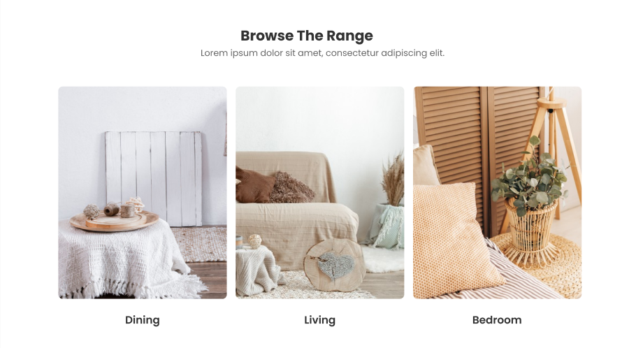
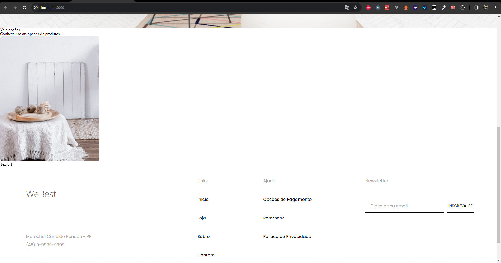
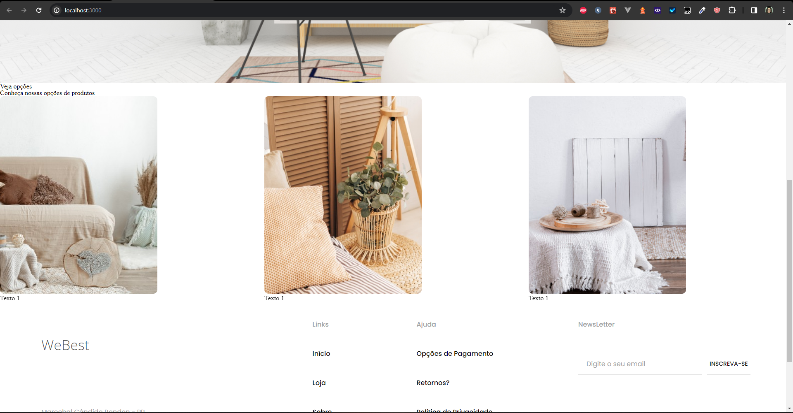
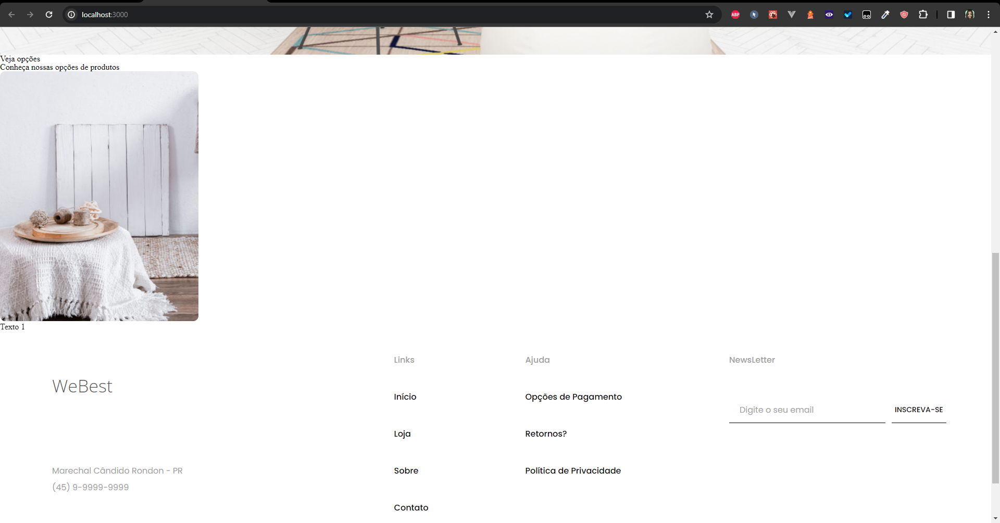
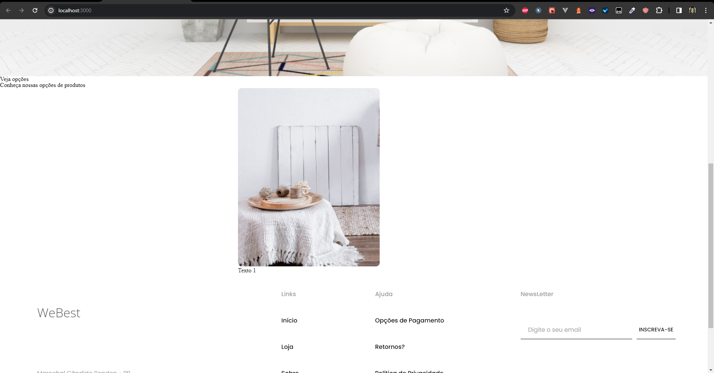
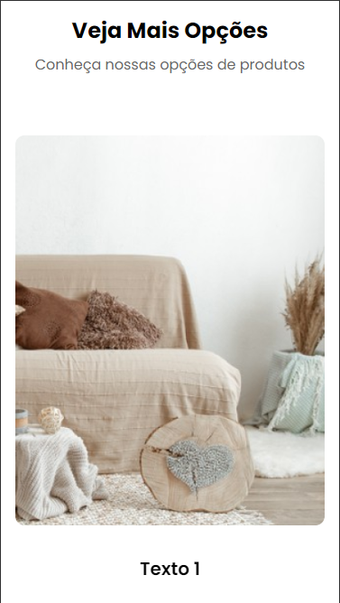
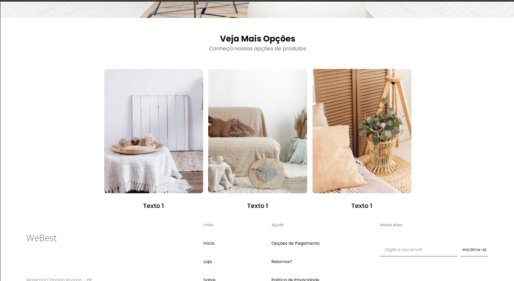

# Parâmetros

O nosso próximo desafio é criar um novo swiper com 3 slides, com isso aprenderemos a utilizar os parâmetros do Swiper.

## O que são parâmetros?

No swiper, quando falamos de parâmetros, estamos nos referindo a todas as opções que podemos passar para o swiper, como por exemplo, a quantidade de slides que queremos que o swiper mostre, se queremos que o swiper mostre a paginação, se queremos que o swiper mostre as setas de navegação, entre outras opções.

O desafio será criar essa nova instância do swiper, com 3 slides:



## Parâmetros que utilizaremos

O desafio para esse novo swiper é bem simples, precisamos apenas passar um parâmetro para o swiper, que é a quantidade de slides que queremos que ele mostre. Para isso, utilizaremos o parâmetro `slidesPerView`, que é responsável por dizer quantos slides queremos que o swiper mostre.

Incentivo você a ler a documentação de parâmetros do [https://swiperjs.com/swiper-api#parameters](Swiper), para entender todas as opções que temos disponíveis.

## Mão na massa

Vamos começar criando um novo componente chamado `VejaOpcoes`, que será terá um título, um subtítulo e um swiper com 3 slides, cada slide contendo uma imagem e um texto. Como já vimos como criar um swiper, não vou representar como seria o código sem o swiper, mas vamos direto para o código do swiper.

Primeiro, crie o componente na pasta `components\home` com o nome `VejaOpcoes.tsx` e exporte o componente. O código do componente será o seguinte:

```javascript
export default function VejaOpcoes() {
	return (
		<div>
			<p> Veja opções </p>
		</div>
	)
}
```

Agora, vamos adicionar o componente à página `Home`:

```javascript
import VejaOpcoes from '../components/home/VejaOpcoes'
import CarouselPrincipal from "@/components/home/CarouselPrincipal";
import Layout from "@/components/layout/Layout";

export default function Home() {
  return (
      <Layout>
        <CarouselPrincipal/>
		<VejaOpcoes/>
      </Layout>
  );
}
```

Com isso feito, vamos ao componente. Primeiro, como dito anteriormente, vamos criar um título, um subtítulo para o swiper. Para isso, vamos utilizar a tag `h2` para o título e a tag `p` para o subtítulo. O código ficará assim:

```javascript
export default function VejaOpcoes() {
	return (
		<div>
			<h2> Veja opções </h2>
			<p> Conheça nossas opções de produtos </p>
		</div>
	)
}
```

Agora, vamos adicionar o swiper. Primeiro, vamo registrar os elementos do swiper, que são `swiper-container` e `swiper-slide`. O código ficará assim:

```javascript
import { register } from "swiper/element";
register();

export default function VejaOpcoes() {
	return (
		<div>
			<h2> Veja opções </h2>
			<p> Conheça nossas opções de produtos </p>
		</div>
	)
}
```

Agora, vamos adicionar os slides. Para isso, vamos adicionar 3 elementos `swiper-slide` e dentro de cada slide, vamos adicionar uma imagem e um texto. O código ficará assim:


```javascript
import { register } from "swiper/element";
import vejaOpcao1 from './vejaOpcao1.png';
import vejaOpcao2 from './vejaOpcao2.png';
import vejaOpcao3 from './vejaOpcao3.png';
register();

export default function VejaOpcoes() {
	return (
		<div>
			<h2> Veja opções </h2>
			<p> Conheça nossas opções de produtos </p>
			<swiper-container>
				<swiper-slide>
					
					<p>Texto 1</p>
				</swiper-slide>
				<swiper-slide>
					
					<p>Texto 1</p>
				</swiper-slide>
				<swiper-slide>
					
					<p>Texto 1</p>
				</swiper-slide>
				<swiper-slide>
					
					<p>Texto 1</p>
				</swiper-slide>
				<swiper-slide>
					
					<p>Texto 1</p>
				</swiper-slide>
				<swiper-slide>
					
					<p>Texto 1</p>
				</swiper-slide>
			</swiper-container>
		</div>
	)
}
```

Neste ponto, ao visualizar a página, você verá que os slides estão sendo exibidos e deve estar como na imagem abaixo:



Agora, vamos adicionar a propriedade `slidesPerView` ao swiper. Para isso, vamos adicionar a propriedade `slidesPerView` ao swiper-container, por favor, note que quando passamos a propriedade para o WebElement `swiper-container`, devemos passar no formato kebab-case, ou seja, `slides-per-view` ao invés de `slidesPerView`, além disso o valor que passamos para a propriedade é um número, mas no caso do WebElement, deve ser em string, ou seja, `"3"` ao invés de `3`. O código ficará assim:

```javascript
import { register } from "swiper/element";
import vejaOpcao1 from './vejaOpcao1.png';
import vejaOpcao2 from './vejaOpcao2.png';
import vejaOpcao3 from './vejaOpcao3.png';
register();

export default function VejaOpcoes() {
	return (
		<div>
			<h2> Veja opções </h2>
			<p> Conheça nossas opções de produtos </p>
			<swiper-container slides-per-view="3">
			<swiper-slide>
					
					<p>Texto 1</p>
				</swiper-slide>
				<swiper-slide>
					
					<p>Texto 1</p>
				</swiper-slide>
				<swiper-slide>
					
					<p>Texto 1</p>
				</swiper-slide>
				<swiper-slide>
					
					<p>Texto 1</p>
				</swiper-slide>
				<swiper-slide>
					
					<p>Texto 1</p>
				</swiper-slide>
				<swiper-slide>
					
					<p>Texto 1</p>
				</swiper-slide>
			</swiper-container>
		</div>
	)
}
```

Neste ponto, ao visualizar a página, você verá que os slides estão sendo exibidos e deve estar como na imagem abaixo:



Com isso, poderíamos finalizar o desafio, mas se perguntou o que aconteceria se adicionássemos menos de 3 slides? Vamos testar isso. Vamos remover 2 slides e deixar apenas 1. O código ficará assim:

```javascript
import { register } from "swiper/element";
import vejaOpcao1 from './vejaOpcao1.png';
register();

export default function VejaOpcoes() {
	return (
		<div>
			<h2> Veja opções </h2>
			<p> Conheça nossas opções de produtos </p>
			<swiper-container slides-per-view="3">
				<swiper-slide>
					
					<p>Texto 1</p>
				</swiper-slide>
			</swiper-container>
		</div>
	)
}
```

O resultado será o seguinte:



Como podemos ver, o swiper está exibindo apenas um slide, mesmo que tenhamos passado a propriedade `slides-per-view` com o valor `3`. Isso acontece porque o swiper não tem 3 slides para exibir, então ele exibe apenas o que tem. Quero apenas destacar uma proprietade interessante do swiper, que é a propriedade `centerInsufficientSlides`, que quando passada como `true`, o swiper centraliza os slides que não estão preenchendo o espaço. Vamos testar isso. Vamos adicionar a propriedade `centerInsufficientSlides` com o valor `true` ao swiper-container. Mais uma vez lembrando que a propriedade deve ser passada no formato kebab-case e o valor deve ser uma string. Além dessa propriedade, vamos adicionar a propriedade `spaceBetween` com o valor `20`, que no caso são pixels, para que os slides fiquem mais separados e a propriedade `breakpoints` com um objeto que define a quantidade de slides que o swiper deve exibir em diferentes tamanhos de tela, para que o swiper fique responsivo. O código ficará assim:

```javascript
import { register } from "swiper/element";
import vejaOpcao1 from './vejaOpcao1.png';
register();

export default function VejaOpcoes() {
	return (
		<div>
			<h2> Veja opções </h2>
			<p> Conheça nossas opções de produtos </p>
			<swiper-container slides-per-view="3" center-insufficient-slides="true" space-between="20"
			breakpoints='{"480": {"slidesPerView": 1}, "601": {"slidesPerView": 2}, "850": {"slidesPerView": 3}}'>
				<swiper-slide>
					
					<p>Texto 1</p>
				</swiper-slide>
			</swiper-container>
		</div>
	)
}
```

O resultado será o seguinte:



Como podemos ver, o swiper centralizou o slide que estava sozinho, mesmo que a propriedade `slides-per-view` tenha sido passada com o valor `3`. Isso é muito interessante, pois podemos ter um swiper com um número fixo de slides, mas que centraliza os slides que não preenchem o espaço. Com isso, finalizamos o desafio de parâmetros. Agora, vamos retornar os 6 swipers como estava anteriormente e estilizar o swiper para que fique mais bonito. Para isso, vamos criar um arquivo chamado `VejaOpcoes.module.scss` na pasta `components\home` e adicionar o seguinte código SCSS:

```scss
@mixin extra-small { 
	@media (max-width: 480px){
	  	@content;
	}
}

@mixin small { 
	@media (min-width: 481px){
		@content;
	}
}

@mixin medium { 
	@media (min-width: 601px){
		@content;
	}
}

@mixin large {
	@media (min-width: 769px){
		@content;
	}
}

@mixin extra-large {
	@media (min-width: 1200px){
		@content;
	}
}

.opcoes{
	@import '../../styles/variaveis.scss';
	width: 100vw;
	display: flex;
	flex-direction: column;
	align-items: center;
	margin-top: 3.5rem;

	h2{
		font-size: 1.5rem;
		font-family: $poppins;
		color: $black;
		font-weight: 700;
		line-height: 3rem;

		@include medium(){
			font-size: 2rem;
		}
	}

	> p{
		font-size: 1rem;
		font-family: $poppins;
		color: $grayDark;
		font-weight: 400;
		line-height: 1.75rem;

		@include medium(){
			font-size: 1.25rem;
		}
	}

	>swiper-container{
		width: calc(100vw - 2rem);
		max-width: 22.5rem;

		@include medium(){
			width: calc(100vw - 4rem);
			max-width: 46.25rem;
		}

		@include large(){
			width: calc(100vw - 6rem);
			max-width: none;
		}

		@include extra-large(){
			width: 73.9375rem;
		}

		swiper-slide{
			display: flex;
			flex-direction: column;
			gap: 1.875rem;
			align-items: center;
			margin-top: 4rem;

			img{
				width: 100%;
				max-height: 30rem;
				object-fit: cover;
				border-radius: 0.625rem;
			}

			p{
				font-size: 1.25rem;
				font-family: $poppins;
				color: $black;
				font-weight: 600;
				line-height: 2.25rem;

				@include medium(){
					font-size: 1.5rem;
					font-family: $poppins;
					color: $black;
					font-weight: 600;
					line-height: 2.25rem;
				}
			}
		}
	}
}
```

Agora, vamos importar o arquivo SCSS no componente `VejaOpcoes` e adicionar a classe `opcoes` ao componente. O código ficará assim:

```javascript
import { register } from "swiper/element";
import estilo from "./VejaOpcoes.module.scss";
import vejaOpcao1 from './vejaOpcao1.png';
import vejaOpcao2 from './vejaOpcao2.png';
import vejaOpcao3 from './vejaOpcao3.png';
register();

export default function VejaOpcoes() {
	return (
		<div className={estilo.opcoes}>
			<h2> Veja Mais Opções </h2>
			<p> Conheça nossas opções de produtos </p>
			<swiper-container center-insufficient-slides="true" space-between="20"
			breakpoints='{"480": {"slidesPerView": 1}, "601": {"slidesPerView": 2}, "850": {"slidesPerView": 3}}'>
			<swiper-slide>
					
					<p>Texto 1</p>
				</swiper-slide>
				<swiper-slide>
					
					<p>Texto 1</p>
				</swiper-slide>
				<swiper-slide>
					
					<p>Texto 1</p>
				</swiper-slide>
				<swiper-slide>
					
					<p>Texto 1</p>
				</swiper-slide>
				<swiper-slide>
					
					<p>Texto 1</p>
				</swiper-slide>
				<swiper-slide>
					
					<p>Texto 1</p>
				</swiper-slide>
			</swiper-container>
		</div>
	)
}
```

Com isso, finalizamos o desafio de parâmetros, abrindo o projeto no navegador, você verá que o swiper está estilizado e responsivo, como nas imagens abaixo:

### Mobile - 375x667



### Tablet - 768x1024


### Notebook - 1280x800


### Desktop - 1920x1080



Obviamente você poderia adicionar mais breakpoints para que o swiper fique responsivo em mais tamanhos de tela, mas para o propósito do curso, esses são suficientes. Com isso, finalizamos o desafio de parâmetros.